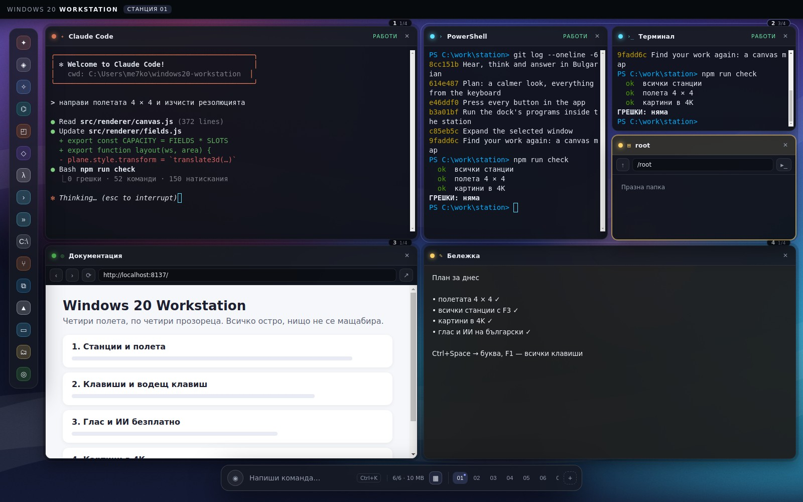
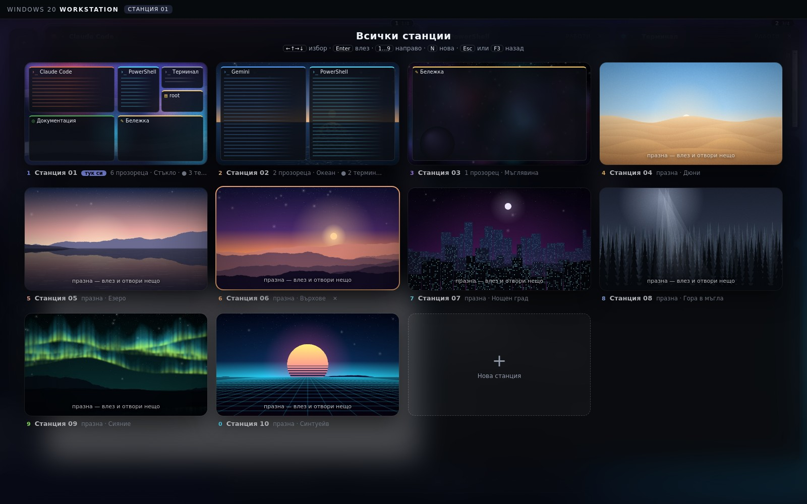
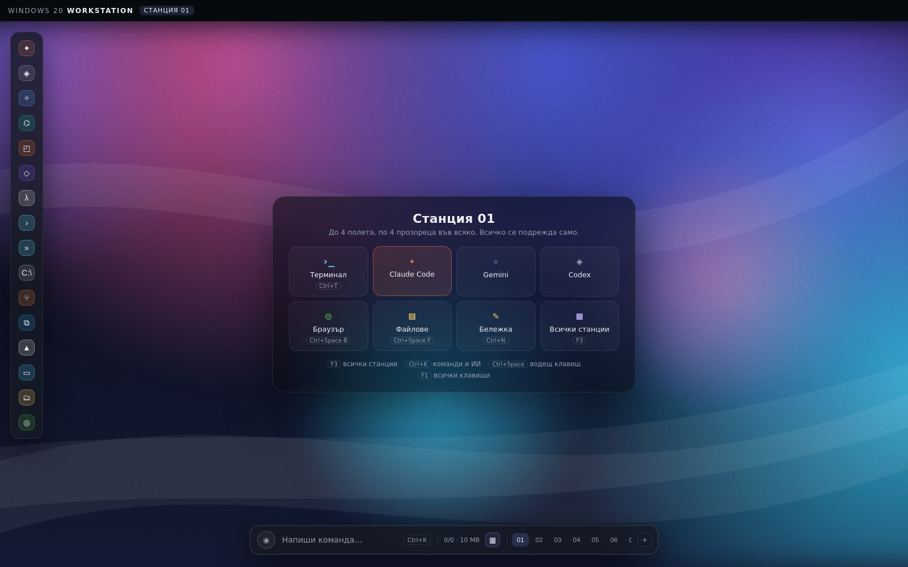
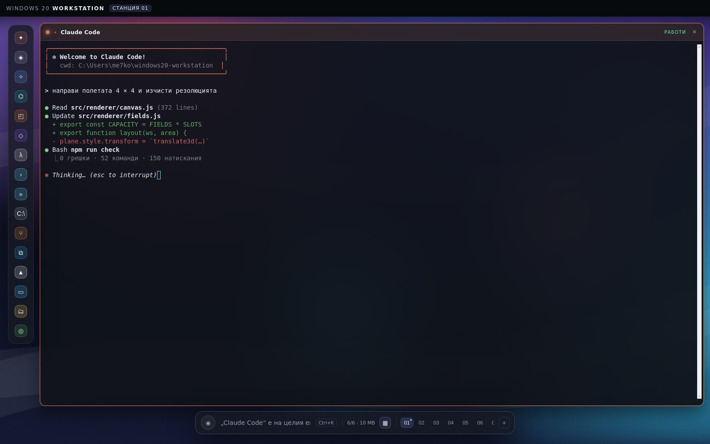
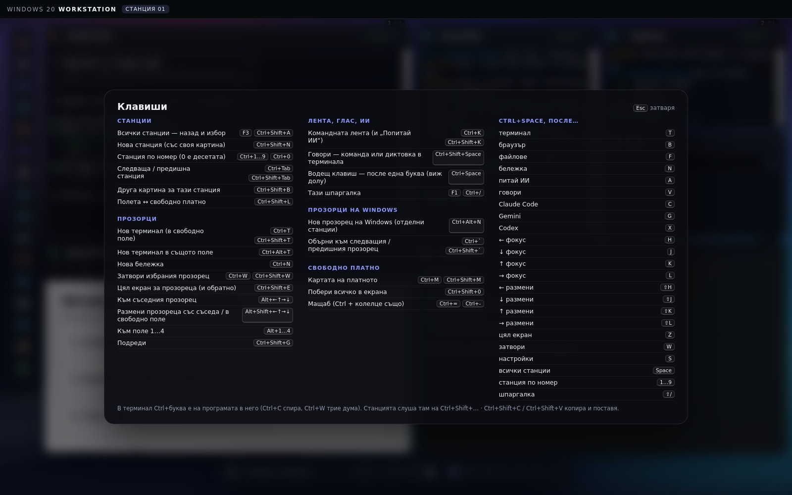
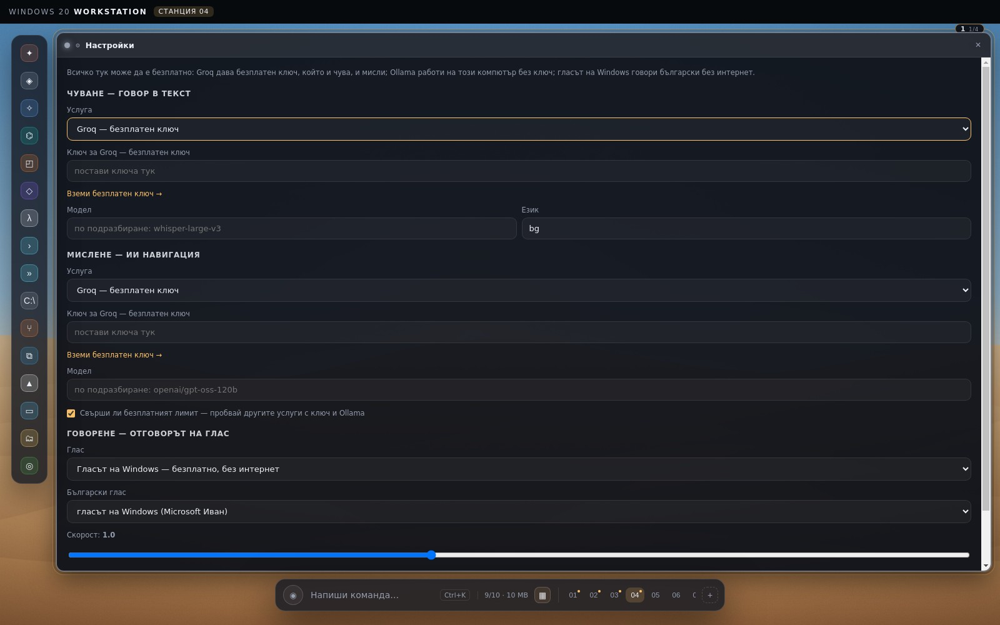

# Windows 20 Workstation

Десктоп за Windows, в който агентите, терминалите и инструментите ти живеят
в **станции**: всяка станция е до **4 полета**, всяко поле — до **4
прозореца**, и всичко се подрежда само. Един клавиш (**F3**) те връща назад да
видиш всички станции наведнъж; избираш една и си вътре.





Идеята започна от [CNVS](https://cnvs.dev) — платно вместо ленти със задачи —
но CNVS е затворен код и само за macOS, затова това е написано от нула и за
Windows.

## Какво прави

- **Станции с 4 полета × 4 прозореца.** Отвориш ли четири неща, те стават
  четири големи полета 2×2; петото влиза в полето, в което работиш, и то се
  дели на две, три, четири. Нищо не се застъпва и **нищо не се мащабира** —
  всеки прозорец е точно пиксел за пиксел, затова текстът в терминалите е
  остър. Празните полета не заемат място: едно поле е целият екран.
- **F3 — всички станции.** Назад виждаш всяка станция като карта: нейната
  картина, полетата ѝ и прозорците в тях, начертани със същата сметка, с
  която ги подрежда самата станция. Стрелки и `Enter`, цифрата ѝ или клик —
  и си вътре. `N` прави нова, `Delete` затваря (с потвърждение). `Ctrl` +
  колелце навън от станция също връща тук.
- **Десет станции от самото начало, колкото искаш после.** Празна станция
  струва само името и картината си. `Ctrl+1…9` и `Ctrl+0` (десетата) водят
  направо.
- **Всяка станция със своя картина в 4K.** Картините не са файлове, а се
  рисуват: десет стила (Върхове, Сияние, Мъглявина, Дюни, Океан, Синтуейв,
  Стъкло, Нощен град, Гора в мъгла, Езеро), всеки в няколко палитри, при
  3840×2160. Нова станция взима стила, който другите ползват най-малко, и нов
  случаен кадър — така десет станции са десет различни места. Картината
  оцветява и станцията (акцентът на фокусирания прозорец, разделите, значката).
  `Ctrl+Shift+B` рисува друга. Рисуването е в отделна нишка, а готовото се
  пази, така че превключването не чака.
- **Цял екран за един прозорец** (`Ctrl+Shift+E` или двоен клик по
  заглавието) — останалите чакат отзад, работещи; пак същото ги връща.
- **Без мишка.** `Alt+стрелки` — към съседния прозорец; `Alt+Shift+стрелки` —
  размени го със съседа или го изкарай в свободно поле; `Alt+1…4` — към поле.
  Влачене по заглавието също разменя два прозореца.
- **Водещ клавиш `Ctrl+Space`**, после една буква: `T` терминал, `B`
  браузър, `F` файлове, `N` бележка, `C` Claude Code, `G` Gemini, `X` Codex,
  `A` питай ИИ, `V` говори, `H J K L` фокус, `⇧H J K L` размяна, `Z` цял
  екран, `W` затвори, `Space` всички станции, `?` всичко. Долу излиза
  подсказка какво следва.
- **F1 — шпаргалка** с всички клавиши. Тя идва от същата таблица, която
  обработва клавишите, затова не може да излъже.
- **Клавишите работят и на кирилица.** Проверява се физическият клавиш, не
  буквата — `Ctrl+K` е `Ctrl+K` и при БДС, и при фонетична подредба.
- **Терминалът си пази своите клавиши.** В терминал `Ctrl+буква` е на
  програмата: `Ctrl+C` спира, `Ctrl+W` трие дума, `Ctrl+K` реже реда.
  Станцията слуша там на `Ctrl+Shift+…` (`Ctrl+Shift+W`, `Ctrl+Shift+K`…).
  Копиране и поставяне като в Windows Terminal: `Ctrl+C` копира, ако има
  маркиран текст, `Ctrl+V` поставя, `Ctrl+Shift+C/V` винаги.
- **Истински терминали** през ConPTY. Прозорецът не е препис на разговора — той
  *е* работещата програма, затова Claude Code, git или каквото пуснеш се държат
  като в Windows Terminal.
- **Всичко от дока се отваря вътре в станцията.** Агентите и обвивките — като
  терминали. **Браузър** — прозорец на същия Chromium, с адресна лента и
  история. **Файлове** — папките, с бутон, който отваря терминал точно там.
  **VS Code** — истинският редактор, през неговия `serve-web`. В дока са и
  **Aider**, **OpenCode**, **Qwen Code** и **Ollama** — агентите, които
  работят с безплатни модели.
- **Агентите получават безплатните ключове сами.** Отвориш ли агент от дока,
  ключовете от Настройките влизат в средата му (`GROQ_API_KEY`,
  `GEMINI_API_KEY`, `OPENROUTER_API_KEY`, `XAI_API_KEY`) — Gemini CLI, Aider и
  OpenCode тръгват на същата безплатна услуга, с която говориш. Само за
  агентите, не за обикновените обвивки, и ключът никога не минава през
  платното.
- **Свободното платно е още тук** (`Ctrl+Shift+L` за станцията): безкрайно
  платно с местене и мащаб, карта (`Ctrl+M`), „Побери всичко“
  (`Ctrl+Shift+0`). И там текстът вече не се размазва след мащабиране (виж
  „Остър текст“ долу).
- **Командна лента (Ctrl+K)** — пишеш и десктопът го прави: отваря програма,
  създава терминал, намира прозорец по име, сменя картина, отваря път или
  адрес. Най-долу винаги стои „Попитай ИИ“.
- **Глас** (`Ctrl+Shift+Space` или микрофона). Ако е фокусиран терминал,
  казаното се **диктува** в него; иначе става **команда**.
- **ИИ навигация на български — безплатно.** Каквото таблицата с команди не
  знае („покажи ми бележката за утре“, „потърси времето в София“), отива при
  ИИ, който избира една от командите, които станцията има в момента, и
  **отговаря на глас, на български**. Groq, Google Gemini, OpenRouter, xAI Grok
  или изцяло на този компютър с Ollama. Свърши ли безплатният лимит на едната
  услуга, заявката минава към следващата, която е настроена.
- **Прозорци на Windows** (`Ctrl+Alt+N`). Ако искаш станции на два монитора,
  всеки прозорец на Windows има свои станции; <code>Ctrl+`</code> обръща
  между прозорците.

## Остър текст

Размазаният текст идваше от три места и трите са махнати:

- **Платното стоеше на свой слой през цялото време** (`will-change:
  transform`). Chromium растеризира такъв слой веднъж и после го разтяга —
  след всяко мащабиране текстът оставаше размит. Сега слоят се иска само
  докато платното се движи; щом спре, се рисува наново, в истинския размер.
- **Половин пиксел.** Прозорци, платно и лентата долу стояха на дробни
  координати (`translate3d` с дроби, `translateX(-50%)`). Сега всичко е на
  цели пиксели на устройството.
- **Замъгляване зад прозорците** (`backdrop-filter`) върху всеки прозорец —
  махнато от прозорците; остава само по лентата и дока.

В полетата мащабът е винаги 1 — там размазване няма откъде да дойде.

## Какво НЕ прави (и защо)

- **Не вгражда чужди GUI прозорци.** Windows няма поддържан начин прозорец на
  друг процес да се пресади в нашия — това не се е променило. Промени се какво
  прави станцията вместо това: там, където програмата има свой уеб режим (VS
  Code през `serve-web`) или където заменяме самата програма, а не прозореца ѝ
  (браузърът е Chromium, файловият прозорец е наш), нещата работят тук. Затова
  в дока вече няма нито една карта „това се отваря навън“. Самите програми на
  Windows не са скрити — „Пусни Chrome в Windows“ и „Пусни Explorer в Windows“
  стоят в лентата — но не те са подразбирането.
- **Cursor може и да не тръгне вътре.** Той е издание на VS Code, но дали носи
  `serve-web`, зависи от версията. Ако не отговори, прозорецът го казва и
  предлага да го пусне навън, вместо да се преструва, че зарежда.
- **Чуването иска интернет** (но не и пари). Electron не носи разпознаване на
  реч — Web Speech API в Chromium говори с услуга на Google, която Electron не
  включва. Затова звукът се записва локално и се праща за транскрипция. Groq
  дава това безплатно, с ключ без карта. Изцяло офлайн е възможно със свой
  Whisper сървър на localhost (напр. faster-whisper-server) — избери „Свой адрес“.
- **ИИ-то не измисля действия.** Първо разпознатият текст се сверява със
  *същата* таблица команди, която ползва и писането — това е мигновено и не
  харчи заявка. Само ако там няма уверено съвпадение, думите отиват при ИИ, а
  той получава списъка с командите и може да отговори само с някоя от тях.
  Станцията проверява отговора срещу списъка още веднъж; измислена команда не
  прави нищо. Необратимото (затваряне на станция с живите ѝ терминали)
  ИИ-то може само да предложи — чака твоя Enter.

## Скрийншоти

`npm run shots` пуска истинското приложение (с фалшиви програми, за да не
тръгва нищо навън) и снима всеки изглед в `docs/screenshots/`:

| | |
|---|---|
|  |  |
|  |  |

## Стартиране

```bash
npm install
npm run rebuild   # построява node-pty за тази версия на Electron
npm start
```

`npm run rebuild` е отделна стъпка нарочно: ако native модулът не се построи,
приложението пак тръгва — просто казва, че терминалите няма да работят, вместо
да откаже да се отвори.

За инсталатор под Windows:

```bash
npm run dist
```

## Проверка

```bash
npm run check
```

Натиска всичко: всеки бутон в дока, всяка команда, която лентата може да
покаже, всяка клавишна комбинация и всеки бутон вътре във всеки вид прозорец —
и събира всяка грешка, която рендерът или основният процес вдигне. Проверката
не пита дали нещо прави правилното (за това е кодът около него); пита дали
изобщо нещо гърми.

Командите не са изброени в теста. Той ги открива, като пише по една буква в
лентата, взима думите на всичко намерено и пита пак, докато спре да излиза
ново — така списъкът идва от самото приложение и не може да остарее.

Нужен е `xvfb` под Linux. Това, което би излязло извън машината — диалогът за
папка, отварянето на път в Windows, стартирането на програма и `serve-web` —
е подменено на самия ръб; всичко над него, целият наш код, върви истински.
Страницата, която браузърът отваря, я вдига самата проверка, за да не зависи
от нищо отвън.

Последно пускане: **182 натискания, 43 клавишни комбинации, 67 открити команди, 0 грешки.** Освен че нищо не гърми, проверката държи и няколко неща, които трябва да са вярни: четири прозореца стават четири полета; станцията спира на 16 и го казва; полетата не се застъпват; прозорците стоят на цели пиксели и нищо не е мащабирано; F3 показва карта за всяка станция; в терминал `Ctrl+W` и `Ctrl+C` са на програмата; `Ctrl+K` работи и на българска подредба; ИИ навигацията срещу фалшива OpenAI-съвместима услуга — ключът не стига до платното, измислена команда не прави нищо, необратимото чака Enter.

## Клавиши

Пълният списък е в приложението: **F1**. Най-важните:

| Клавиш | Действие |
|---|---|
| `F3` или `Ctrl+Shift+A` | всички станции — назад и избор |
| `Ctrl+1…9`, `Ctrl+0` | станция по номер (0 е десетата) |
| `Ctrl+Tab` / `Ctrl+Shift+Tab` | следваща / предишна станция |
| `Ctrl+Shift+N` | нова станция (със своя картина) |
| `Ctrl+K` (в терминал `Ctrl+Shift+K`) | командната лента и „Попитай ИИ“ |
| `Ctrl+Space`, после буква | водещ клавиш (виж горе) |
| `Ctrl+T` (в терминал `Ctrl+Shift+T`) | нов терминал в свободно поле |
| `Ctrl+Alt+T` | нов терминал в същото поле |
| `Ctrl+W` (в терминал `Ctrl+Shift+W`) | затвори прозореца |
| `Ctrl+Shift+E` / двоен клик по заглавието | цял екран за прозореца и обратно |
| `Alt+стрелки` | към съседния прозорец |
| `Alt+Shift+стрелки` | размени със съседа / в свободно поле |
| `Alt+1…4` | към поле |
| `Ctrl+Shift+Space` | говори |
| `Ctrl+Shift+B` | друга картина |
| `Ctrl+Shift+L` | полета ↔ свободно платно |
| `F1` или `Ctrl+/` | шпаргалката |
| `Ctrl+Alt+N`, <code>Ctrl+`</code> | нов прозорец на Windows, обръщане между тях |


## Колко струва — памет и скорост

Станциите растат, без цената да расте с тях. Три правила:

- **Напусната станция връща своя DOM.** Прозорците се изграждат наново от
  модела при връщане. Изключение е станция с жив терминал: този процес не
  може да се пресъздаде, само да се убие, затова остава сглобен, но скрит.
- **Не се рисува прозорец, който екранът не достига.** Скриването е през
  `visibility`, а не `display` — терминалът пази кутията, от която си е измерил
  колоните.
- **Замъгляването зад прозорците пада, докато платното се движи**, и при силно
  отдалечаване съдържанието изобщо не се рисува: остава карта от рамки с
  заглавия и цветове.

Измерено с една и съща подредба — 540 прозореца, най-голямата станция с 300
— в Linux контейнер със *софтуерно* рисуване без GPU. На Windows с видеокарта
числата са доста по-добри; разликата между двете колони е това, което значи:

| | преди | след |
|---|---|---|
| прозореца в DOM след обход на станциите | 420 и расте | 300 — колкото е активната |
| от тях рисувани при мащаб 1 | 300 | 36 |
| кадър при местене, мащаб 1 | 73.0 ms | 26.9 ms |
| кадър при отдалечено платно | 108.5 ms | 72.0 ms |

(Старата версия имаше най-много четири пространства, затова стигаше до 420 от
540. Новата държи 300 независимо колко станции съществуват.)

Картата не се брои към тази сметка. Тя е едно 2D платно, не триста елемента, и
рисува само правоъгълници — измерено при 304 отворени прозореца, кадърът при
местене е **26.5 ms с включена карта срещу 25.8 ms без нея**, тоест разликата е
в шума на измерването.

Мащабът слиза до 0.02 нарочно: „побери всичко“ трябва да работи и когато
работата е разпръсната на петдесет екрана. Под 0.45 съдържанието на прозорците
изобщо не се рисува, затова най-широкият изглед е и най-евтиният. Ако дори това
не стигне, приложението го казва, вместо да остави прозорец извън екрана мълчешком.

**Плавност.** Мишка за игри праща до хиляда движения в секунда; екран на 144 Hz
рисува 144 кадъра. Всяко движение, което пише в DOM, значи седем оформления на
кадър и браузър, който изостава от ръката. Затова входът не пипа DOM изобщо —
натрупва се и един кадър го превръща в едно писане. Измерено при 300 прозореца:

| | преди | след |
|---|---|---|
| 500 събития от мишката, работа по нишката | 8.6 ms | **2.6 ms** |
| 95-и персентил на кадъра (1 събитие/кадър) | 50.2 ms | **21.9 ms** |
| 95-и персентил на кадъра (8 събития/кадър) | 44.7 ms | **25.5 ms** |
| среден кадър | 23.9 ms | 20.2 ms |

Средният кадър мърда малко, защото опира в контейнера, а не в кода: тук
композирането е софтуерно и **празно платно вече струва 22.6 ms на кадър**. 144
Hz не може да се докаже на такава машина и няма да го твърдя. Което се доказва,
е другото — че работата на кадър вече не зависи от това колко често съобщава
мишката, и че опашката, тоест засичанията, падна наполовина.

Три неща го правят: входът се натрупва и се харчи веднъж на кадър; мащабът и
плъзгането след пускане се смятат по изминало време, а не по брой кадри, така
че се усещат еднакво на 60 и на 144 Hz; и точковата решетка вече се мести с
`transform` вместо с `background-position`, което спря преначертаването на цял
екран при всяко местене.

Лентата долу показва `изградени/всичко · MB` — числото вляво е точно тази
разлика. Остатъкът, който наистина расте, са терминалите: всеки е процес плюс
2000 реда история, тоест няколко MB. При 16 GB това значи десетки едновременни
агенти, а не единици.

**Колко струва един прозорец на Windows.** Всеки е отделен процес на рендера, затова цената
ѝ е истинска, но постоянна. Измерено с три отворени прозореца, по един терминал
във всяка:

| | |
|---|---|
| обща памет на трите | 892 MB в 6 процеса |
| на прозорец (процесът на платното) | ~158 MB |
| общо за всички (основен процес, GPU) | ~417 MB |

Тоест вторият и третият прозорец струват по ~158 MB. При 16 GB три прозореца са
под гигабайт — таванът не е броят прозорци, а колко агента държиш живи в тях.

## Структура

```
src/main/
  main.js        жизнен цикъл, прозорец, IPC
  preload.js     единственият мост между платното и машината
  pty.js         ConPTY сесии
  programs.js    каталог и откриване на инсталираните програми
                 (и как всяка се отваря вътре в станцията)
  store.js       подредбата на всички станции в един файл
  settings.js    ключовете — извън repo-то и извън рендера
  providers.js   безплатните и платените услуги като данни
  stt.js         говор в текст
  ai.js          ИИ навигацията: изречение → една от командите
  speech.js      текст в говор през Windows или Azure
src/main/
  models.js      намира модел, който още съществува, когато услуга спре стария
src/renderer/
  boot.js        сглобяване, док, празната станция
  keymap.js      всички клавиши в една таблица, водещият клавиш, шпаргалката
  fields.js      сметката на полетата: 4 × 4, без застъпване
  overview.js    всички станции (F3)
  pictures.js    картините в 4K — рисувани, не файлове
  pictures-worker.js  рисува ги в отделна нишка
  picture-store.js    пази нарисуваното (памет и IndexedDB)
  canvas.js      платното (в полета — заключено на мащаб 1)
  minimap.js     картата на платното долу вдясно
  workspaces.js  станциите, полетата и живите прозорци
  node-window.js прозорец: местене, оразмеряване, фокус
  command-bar.js Ctrl+K лентата и таблицата с команди
  toast.js       съобщения
  voice.js       микрофонът
  speaker.js     гласът, с който станцията отговаря
  nodes/         съдържание: терминал, бележка, браузър, файлове,
                 стартер, настройки
```

## Глас и ИИ — безплатна настройка

Най-краткият път — **един безплатен ключ за всичко**:

1. Влез в [console.groq.com/keys](https://console.groq.com/keys) (регистрация
   без карта) и създай ключ.
2. `Ctrl+K` → „настройки“ (или „Вземи безплатен ключ →“ в самите Настройки —
   страницата се отваря вътре в станцията).
3. Постави ключа в „Чуване“. „Мислене“ също е Groq и ползва същия ключ —
   не е нужно да го пишеш втори път.
4. **Български глас.** В Windows: Настройки → Час и език → Говор → Добавяне на
   гласове → **Български** (Microsoft Иван). Безплатно е и работи без интернет.
   После „Пробвай гласа“ в Настройките на станцията.
5. `Ctrl+Shift+Space`, кажи „отвори браузъра“ или „потърси рецепта за баница“,
   натисни пак.

| | Безплатно | Бележка |
|---|---|---|
| **Чуване** | Groq (`whisper-large-v3`) | или **Whisper на този компютър** — без ключ и без интернет (виж долу) |
| **Мислене** | Groq (`openai/gpt-oss-120b`), Google Gemini (Flash-Lite — стотици заявки на ден), OpenRouter (`:free` модели), Ollama | Ollama е на този компютър, без ключ и без интернет; на безплатния план Gemini Google може да ползва данните за обучение |
| **Grok** | не е безплатен | xAI Grok е в списъка, но иска кредити в xAI |
| **Говорене** | гласът на Windows (Иван) | без интернет; Azure (Калина, Борислав) звучи по-живо и има безплатен план F0, но иска Azure акаунт |

Безплатните лимити на услугите се сменят. Когато някой се изчерпи (грешка
429), заявката минава към следващата настроена услуга — Groq → Gemini →
OpenRouter → Grok → Ollama — и тостът казва кой е отговорил. Изключва се с
отметката под „Мислене“.

**Спрени модели.** Безплатните услуги спират модели на всеки няколко месеца —
Groq спря Llama 3.3 70B на 16 август 2026. Когато услугата каже, че моделът го
няма, станцията я пита какви модели има сега и взима първия подходящ, вместо
да спре да работи. Свой модел може да се впише в полето „Модел“.

**Whisper без интернет.** Пусни [speaches](https://speaches.ai)
(faster-whisper-server) на този компютър — например с Docker:
`docker run -p 8000:8000 ghcr.io/speaches-ai/speaches:latest-cpu` — и избери
„Whisper на този компютър“ в „Чуване“. Всеки друг OpenAI-съвместим Whisper
сървър става през „Свой адрес“.

Езикът на чуване по подразбиране е `bg`.

Ключовете се пазят в потребителската папка на Windows с права само за теб,
никога в repo-то, и **не се връщат към платното** — рендерът научава
единствено *дали* има ключ, не какъв е. Така бъг в кода на платното не може да
го прочете. Ключът е един на услуга, не на задача: ключът за Groq и чува, и
мисли.

Терминалите нарочно не се запазват на диск — процес не преживява рестарт, а
мъртва черупка, която изглежда жива, е по-лошо от празно платно.
